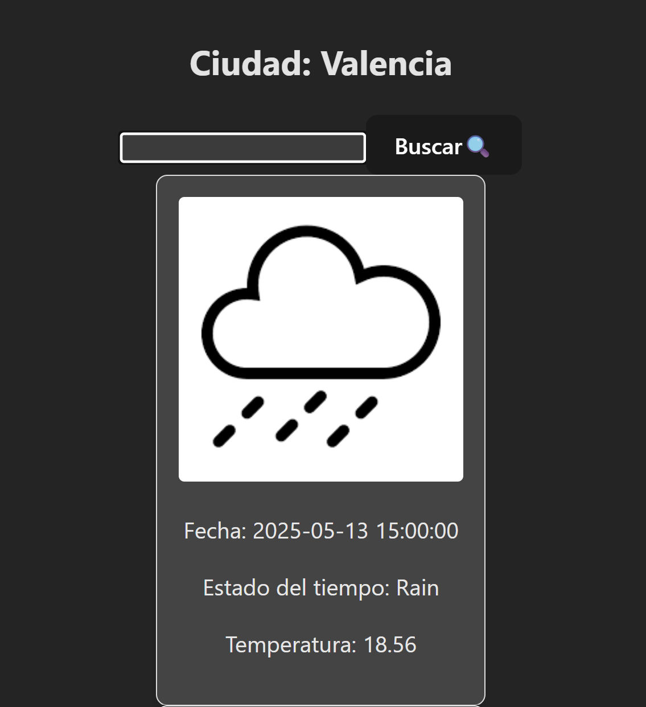

# 🌦️ Weather App con React

Este proyecto es una aplicación simple de clima desarrollada con **React** que muestra la información meteorológica de una ciudad en los proximos 3 dias mediante la API de **OpenWeatherMap**.

---

## ✨ Funcionalidades

- ✅ Proyecto realizado con React.
- 🏙️ Llamada a la API de OpenWeatherMap para mostrar el clima de la ciudad.
- 🔄 Manejo de formulario con `setValue` y `setPosts` para cambiar la ciudad manualmente.
- 📡 Uso de `axios` para las llamadas HTTP a las APIs.
- 🔃 Al cambiar de ciudad, se hace una nueva llamada a la API y se actualiza la información en pantalla.

---

## 🧰 Tecnologías utilizadas

- React
- React Hooks: `useState`, `useEffect`
- Axios
- OpenWeatherMap API

---

## 🖼️ Capturas de pantalla



---

## 🚀 Cómo iniciar el proyecto

```bash
# Clona el repositorio
git clone https://github.com/AlbeertoDZ/WeatherApp.git
cd WeatherApp

# Instala las dependencias
npm install

# Crea tu archivo de entorno con la API KEY de la web de OpenWeatherMap
cp .env.example .env

# Iniciar el proyecto
npm run dev

#Pagina del proyecto
